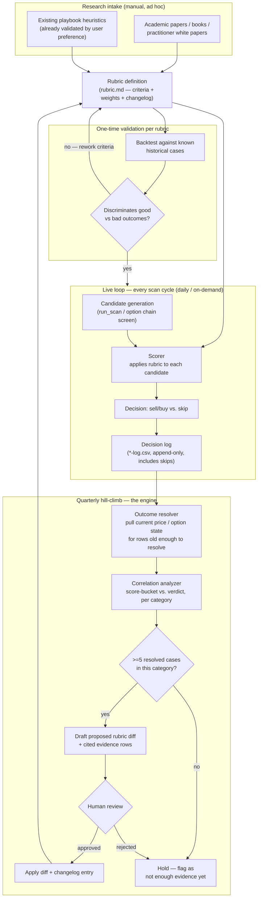
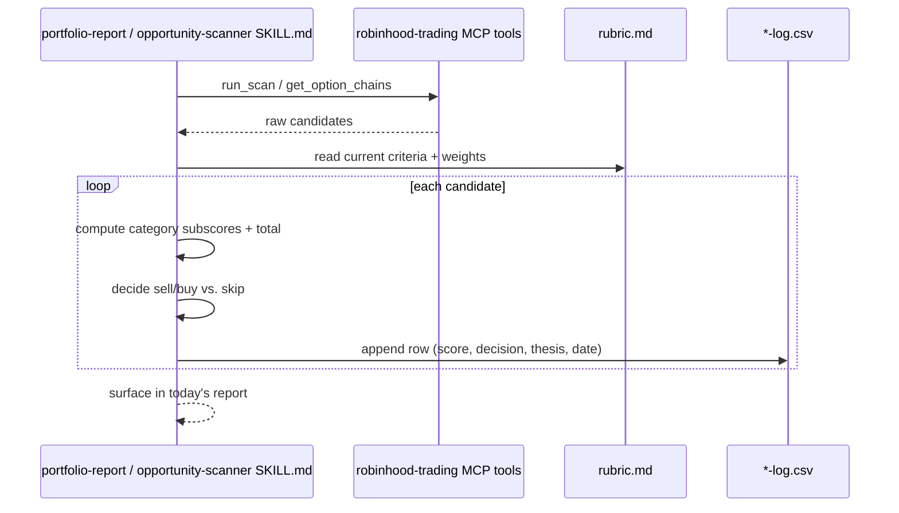
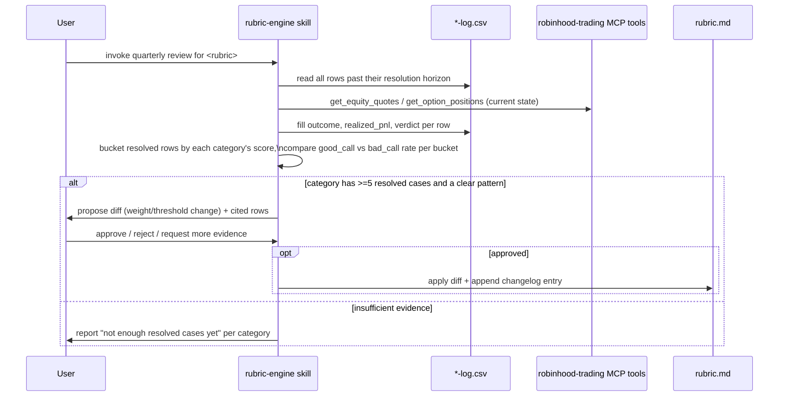

# Rubric engine: system design

`RUBRICS.md` describes the five-stage *process*. This doc is the system
design for the thing that actually runs it — components, data flow, and
the concrete engine (`.claude/skills/rubric-engine/`) that turns the
"hill-climb" stage from prose into something invokable.

## Design constraint that shapes everything below

This is a few-trades-per-quarter retail account, not a systematic fund.
The engine is therefore **decision-support, not decision-making**: it
proposes rubric changes with cited evidence, but a human approves every
change before it lands (see Stage 4 of `RUBRICS.md` — never reweight on
<5 resolved cases, and even above that bar, nothing self-applies). There
is no autonomous trading and no autonomous rubric-editing here.

## Components

| Component | What it is | Where it lives |
|---|---|---|
| Research intake | Papers/books/practitioner research, curated by hand | `RUBRICS.md` § Literature backing today's rubrics |
| Rubric definition | Versioned criteria + weights + changelog | `rubric.md` / `option-suggestion-rubric.md` |
| Candidate generator | Produces raw candidates to score | `run_scan` (saved scanners) / `get_option_chains` + `get_option_instruments` |
| Scorer | Applies a rubric to a candidate → category subscores + total | Executed inline by `opportunity-scanner`/`portfolio-report` SKILL.md steps |
| Decision log | Append-only fact table: candidate + score + decision + (later) outcome | `reports/opportunity-scanner-log.csv`, `reports/option-suggestion-log.csv` |
| Outcome resolver | Fills in what actually happened, once enough time has passed | `rubric-engine` skill, step 1 |
| Correlation analyzer | Buckets resolved rows by score, checks which categories discriminate | `rubric-engine` skill, step 2 |
| Proposal drafter | Turns a discriminating pattern into a specific, cited rubric diff | `rubric-engine` skill, step 3 |
| Human approval gate | Nothing changes without explicit sign-off | `rubric-engine` skill, step 4 |
| Rubric editor | Applies an approved diff + changelog entry | `rubric-engine` skill, step 5 |

## Workflow

### Single scan-cycle sequence (what happens every run)

### Quarterly hill-climb sequence (the engine's actual run)

## The engine itself

Implemented as a new skill, `.claude/skills/rubric-engine/SKILL.md` —
generic across both live rubrics (and any future one registered in
`RUBRICS.md`'s table), parameterized by which rubric/log pair to run
against. See that skill for the exact steps; it is a direct
implementation of `RUBRICS.md` Stages 3–4, not a separate methodology.

## Why not more automated than this

A fully automated version (auto-resolve, auto-reweight, auto-commit) was
considered and rejected:
- Sample sizes are inherently small (a few decisions a quarter) — the
  entire point of the ≥5-case rule is to resist exactly the kind of
  confident-looking-but-noise-fitting update an automated pipeline would
  cheerfully produce.
- A rubric change here directly changes future real-money decisions.
  `RUBRICS.md`'s changelog requirement exists so a human can audit *why* a
  threshold moved — that's meaningfully weaker if a human never had to
  approve the move in the first place.
- This mirrors the same posture already established for trading itself:
  `robinhood-trading` MCP tools are read-only from these skills
  (`place_equity_order`/`place_option_order` are never called) — the
  engine proposes, the account holder decides, all the way up the stack.
