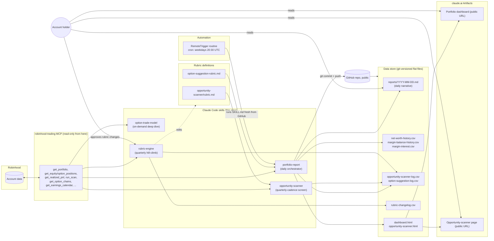

# System design: the whole trading-analysis system

This is the top-level design for everything in this repo — not just the
rubric engine (`RUBRIC-ENGINE.md`) but how it fits with daily reporting,
opportunity screening, and the cloud automation. Read this first; the
other design docs (`RUBRICS.md`, `RUBRIC-ENGINE.md`) go deeper on the
rubric lifecycle specifically.

## What this is

A read-only (no auto-trading) personal finance analysis system: three
Claude Code skills, backed by a `robinhood-trading` MCP connection, that
turn raw account data into daily reports, a screened opportunity list, and
scored option-selling suggestions — plus a fourth skill that periodically
reviews whether the scoring itself is any good. Everything persists as
flat files (markdown + CSV) versioned in this git repo. There is no
database, no server, and no code outside of skill definitions — the
"application" is the combination of Claude Code + these skill files + the
MCP tool connection.

## High-level architecture

## Skills catalog

| Skill | Purpose | Cadence | Key reads | Key writes |
|---|---|---|---|---|
| `portfolio-report` | Daily orchestrator: holdings, margin, tax, dividends, option-selling suggestions | Daily (weekdays, cloud-scheduled) | `robinhood-trading` MCP, both rubric files, prior day's report | `reports/YYYY-MM-DD.md`, `net-worth-history.csv`, `margin-balance-history.csv`, `option-suggestion-log.csv`, `dashboard.html` |
| `opportunity-scanner` | Screens for asymmetric turnaround/compounder candidates | Daily mechanical subscore (via portfolio-report step 7); full rubric run quarterly or on demand | `robinhood-trading` MCP (`run_scan`), `rubric.md` | `opportunity-scanner-log.csv`, `opportunity-scanner.html` |
| `option-trade-model` | Deep quantitative workup (Black-Scholes, tax-adjusted EV) for one specific candidate | On demand only | `robinhood-trading` MCP | Nothing persistent — conversational output, occasionally folded into a report's deep-dive section |
| `rubric-engine` | Resolves logged outcomes, checks which rubric categories discriminate, proposes evidence-cited changes | Quarterly | Both `*-log.csv` files, `robinhood-trading` MCP (for current prices/positions) | `rubric-changelog.csv`, and (only on human approval) the rubric `.md` files themselves |

None of these ever call `place_equity_order` or `place_option_order` —
every suggestion is surfaced for the account holder to act on manually, if
at all.

## Data store catalog

This is the part worth designing carefully — per-file schema, grain, and
mutability, since (per the reason this doc exists) this collection of
flat files *is* the system's database, and it's going to keep growing.

| File | Grain (one row/file = ) | Mutability | Written by | Consumed by |
|---|---|---|---|---|
| `reports/YYYY-MM-DD.md` | One calendar day's full narrative report | Immutable once written (new day = new file) | `portfolio-report` | Human; next day's report (for the "changes since yesterday" diff) |
| `reports/dashboard.html` | Current snapshot only (not historical — overwritten each run) | Mutable, always reflects latest run | `portfolio-report` | Redeployed as the `dashboard` Artifact (public URL in `.artifact-url`) |
| `reports/net-worth-history.csv` | One trading day | Append-only | `portfolio-report` step 8 | Future trend charts; quarterly reviews |
| `reports/margin-balance-history.csv` | One (day, margin account) pair | Append-only | `portfolio-report` step 3 | Margin-interest estimate, loan-to-value trend |
| `reports/margin-interest.csv` | One actual statement figure, whenever the user supplies one | Append-only, sparse | Manual (user pastes a real figure) | Ground-truth check against the tracked estimate |
| `reports/opportunity-scanner-log.csv` | One scored candidate (sell *or* skip) | Append-only rows; outcome columns (`outcome_1q`, `outcome_1y`) filled in later by `rubric-engine` | `opportunity-scanner` (score), `rubric-engine` (outcomes) | `rubric-engine`'s correlation analysis |
| `reports/opportunity-scanner.html` | Current snapshot only | Mutable | `opportunity-scanner` | Redeployed as its own Artifact (public URL in `.opportunity-scanner-artifact-url`) |
| `reports/option-suggestion-log.csv` | One suggested option trade (sell *or* skip) | Append-only rows; `outcome`/`realized_pnl`/`verdict`/`score_*` filled in later | `portfolio-report` (suggestion + score), `rubric-engine` (outcomes) | `rubric-engine`'s correlation analysis |
| `reports/rubric-changelog.csv` | One proposed rubric change, with a full timestamp | Append-only; `status` field is the only thing ever updated in place (proposed → approved/rejected) | `rubric-engine` | Audit trail; future analysis of which changes actually helped |
| `.claude/skills/*/rubric.md`, `option-suggestion-rubric.md` | The current, versioned rubric definition | Mutable, but only via `rubric-engine` Step 5 after human approval; every change also gets a prose line in the file's own `## Changelog` | Human approval via `rubric-engine` | Every scoring pass in `portfolio-report`/`opportunity-scanner` |

Two deliberate redundancies, both intentional rather than duplication to
clean up:
- **`dashboard.html`/`opportunity-scanner.html` vs. the CSVs/markdown
  reports**: the HTML is a rendered *view*, not a data store — it's
  regenerated from the same numbers every run and holds no history of its
  own. If it were ever lost, nothing is lost except presentation; the CSVs
  and dated markdown files are the actual source of truth.
- **Prose changelog in `rubric.md` vs. `rubric-changelog.csv`**: the prose
  is for a human reading the rubric inline; the CSV is the queryable,
  timestamped, structured record of the same fact. Keep both — see
  `rubric-engine`'s Step 5.

## Why flat files instead of a real database

- **Git provides versioning and audit for free.** Every change to every
  file already has a commit, a timestamp, and (via commit messages) a
  reason — a lightweight audit log the system didn't have to build.
- **Human-readable without tooling.** A CSV opens in any spreadsheet; a
  markdown report reads directly on GitHub. No query language required to
  answer "what did we say about GOOG last month."
- **Zero infrastructure**, appropriate for a personal, few-trades-a-quarter
  account — a real database would be solving a problem this system
  doesn't have.
- **Portable.** Because it's all plain files in git, nothing has to be
  migrated to make future use possible — see below.

## Future-proofing the data store

This is the part the user specifically flagged as worth designing for.
Since every log is a flat, append-only CSV with a stable schema:

- **It can be loaded into pandas/a notebook at any time** for real
  statistical analysis (regression, not just bucket comparison) once N
  grows large enough — nothing about today's format blocks that later.
- **It can be pointed at a BI tool** (Google Sheets, Metabase, even a
  spreadsheet pivot table) for visualization without touching the source
  of truth — the CSVs stay the ground truth, the BI tool is just a lens.
- **It could become a labeled dataset** if this account ever moves toward
  a more systematic (less discretionary) approach — every suggestion, its
  score, and its eventual outcome, timestamped, is exactly the shape of
  data that would require.
- **Schema stability matters more than schema elegance.** When a log's
  shape needs to grow (e.g. adding the `score_*` columns to
  `option-suggestion-log.csv` after the fact), append new columns rather
  than renaming or restructuring existing ones — old rows stay loadable
  without special-casing, which is exactly what happened when those
  columns were added retroactively with blank values for pre-existing
  rows.
- **Never delete a row.** Every log in this system is designed so the
  full history is reconstructable from the files alone — status fields
  get updated in place (e.g. `rubric-changelog.csv`'s `proposed` →
  `approved`), but nothing is ever removed.

## See also

- `RUBRICS.md` — the five-stage rubric lifecycle (generate, log, resolve,
  hill-climb, repeat) and the research grounding behind today's two
  rubrics.
- `RUBRIC-ENGINE.md` — the rubric engine's own component design and
  workflow diagrams, one level of detail below this doc.
